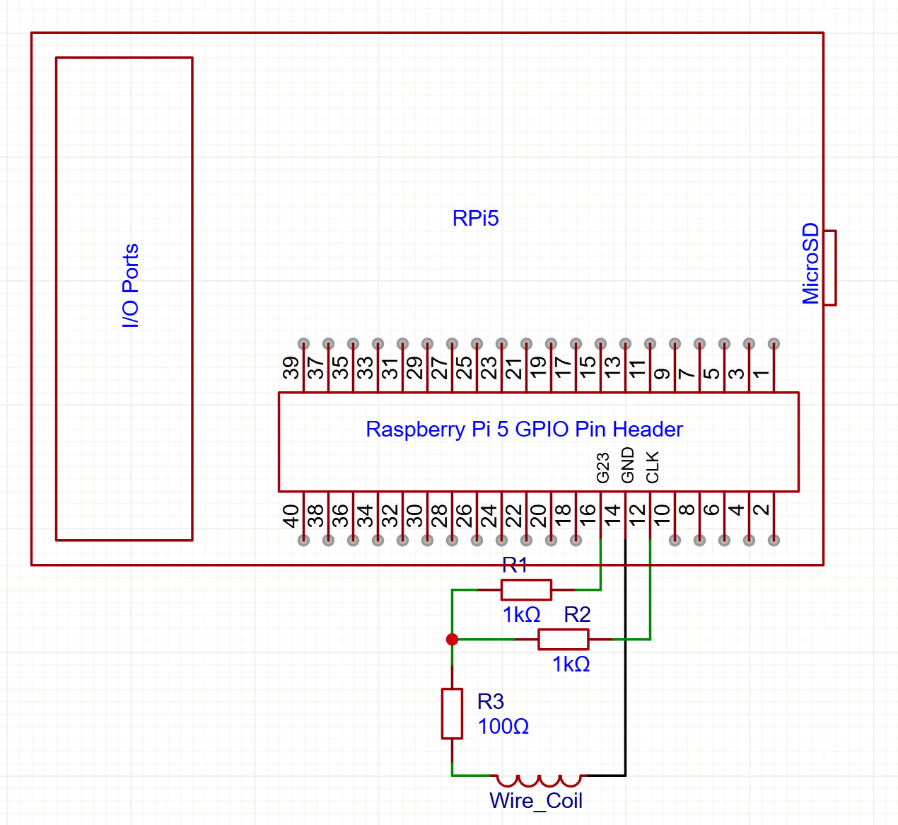
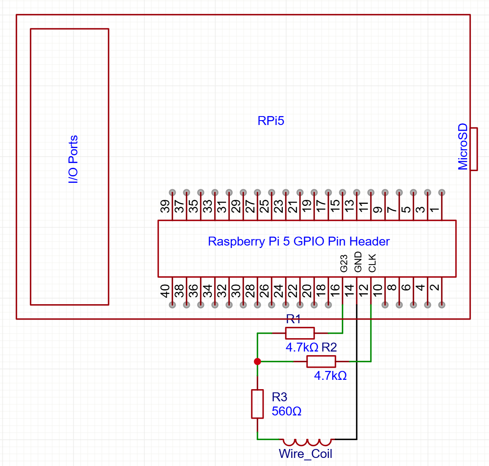

# DCF77-Pi5


DCF77 signal transmitter for Raspberry Pi 5.

This project generates a 77.5 kHz carrier and applies DCF77 amplitude modulation to synchronize European radio-controlled watches and clocks using near-field magnetic coupling.

Encoding logic is inspired by [hzeller/txtempus](https://github.com/hzeller/txtempus/), which supported older Raspberry Pi models using direct GPIO register access. Raspberry Pi 5 introduces the RP1 I/O controller, removing direct `/dev/mem` GPIO access and changing clock architecture, making previous implementations incompatible.

This project uses the RP1 PIO peripheral to generate a highly accurate carrier signal.

> [!Caution]
> Check local laws & regulations in regards to restrictions on ratio transmissions before running this program


### Raspberry Pi 5

Pi5 with RP1 chip has disabled access to /dev/mem for direct GPIO writing and also removed access to the system/hdmi/audio etc. clocks. In order to generate the desired frequency (77.5kHz) there are 2 possible ways:

1. Implemented **PIO mode**: RP1 supports PIO which runs pioasm programs and routes them to a GPIO pin. Documenation on it is very sparse however. it is compatible with most RP2040 PIO commands and it is based on PicoSDK. This allows access to the clk_sys @ 200MHz with the ability to set the clock divider leading to sub-Hz accuracy. 

2. **PWM mode**: Much simpler. Use through sysfs after enabling its dtoverlay in ``/boot/firmware/config.txt``. This however uses a fixed 50 MHz clock (xosc), which limits achievable frequency precision compared to PIO driven from the 200 MHz system clock.


## Supported Time Services

### [DCF77](https://en.wikipedia.org/wiki/DCF77)

DCF77 is an atomic time signal with a carrier of 77.5kHz and Amplitude Modulation once per second for a full minute. The modulation occurs by attenuating the carrier for 100ms || 200ms translating to '0' || '1' bit respectively. Furthermore, on the 59th second there is no attenuation present for synchronization purposes. Finally, in-case of a leap second, the 59th second contains '0' and the extra 60th is used for synchronization.

Currently there are no plans to implement more encodings from 
[hzeller/txtempus](https://github.com/hzeller/txtempus/).

## External Hardware

The Hardware used is the same as txtempus with slight optional modifications:

The frequency output is configured on GPIO 18 while the attenuation pin is configured on GPIO 23.
Revised version offers slightly higher current => better magnetic coupling  & better signal-to-noise ratio.
If that exceeds your local legal limits, feel free to use the original.

To operate you need 3 resistors:

**Revised Version** (Higher Current -> Slightly more range): x2 1kΩ and x1 100Ω wired on GPIO 18 and GPIO 23 as shown:



**Original Version**: x2 4.7kΩ and x1 560Ω wired on GPIO 18 and GPIO 23 as shown:



GPIO18 and GPIO23 are on the outer row of the Header pin.
The middle pin is Ground. 


For the coupling coil, use a thin copper wire and loop around itself to create an air-coil. Around 10-20 turns (circles) is enough depending on the wire thickness. Mine is 7 turns of 16AWG wire.

> [!Note]
> This setup can be refined with either  1. ferrite core 2. LC Circuit, more on that below 3. Amplifier. However all these options lead to more interference along with range extension and may exceed local radio transmission limits.


Once connected, simply place the watch on the coil (or in very close proximity), start the program and put it in receive mode.

## Building the program 

### Dependencies

First make sure you have updated packages and firmware:

```bash
sudo apt update && sudo apt full-upgrade
sudo rpi-eeprom-update -a #updates Pi firmware
```

Install dependencies:

We use GPIO lib for GPIO contol and PIOlib for Signal generation through high-speed clock

```bash
sudo apt-get install git build-essential cmake -y
sudo apt install -y libgpiod-dev libpio-dev libpio0
```

### Build

```bash
git clone https://github.com/fatherakis/dcf77-pi5.git
cd dcf77-pi5
cmake -S . -B build -DCMAKE_BUILD_TYPE=Release
cmake --build build -j

cp build/bin/dcf77-pi5 ./
```

### Optinal (Install)

If you want to invoke dcf77-pi5 from anywhere in your terminal:

```bash
sudo cmake --install build
```

### Run

```bash
sudo ./dcf77-pi5 -s local -v
```

With ``-s`` or ``--source`` you can set the time source from either the Pi5 internal time ``local`` or from an NTP server ``ntp``

These are all the supported options:
```bash
Usage: sudo ./dcf77-pi5 -s [local|ntp] [-l minutes] [-o minutes] [-v]
Required:
  -s, --source   local|ntp   (required)
Options:
  -l, --limit    minutes     (>0 if provided, Default: 960mins (16 hours)) 
  -o, --offset   minutes     (Transmit offset time from Germany local time)
  -v, --verbose
  -h, --help                 (This message)
```

> [!Note]
> This program also implements DST and Leap second flags compared to the original inspired version. Note for leap second flag, NTP time source is required.


## Increase Hardware Power

> [!WARNING]
> Legal note: Check local laws & regulations in regards to restrictions on ratio transmissions before any attempt increasing power on your transmitter.

If you want to further improve reading distance and power here are a few options:

1. Change your air coil with a ferrite core one, they tend to be inexpensive in local markets and online.

    1a. Measure your coil's impedance and connect a parallel LC Circuit. Lookup LC calculator for your desired frequency (eg. 77500Hz)

2. Implement an external amplifier circuit to further strengthen output current.


In any case you implement your own circuitry, in [gpio_conf](./gpio_conf/) folder there is an overlay to change the CMOS Drive current of a GPIO Pin.

Install dependency:
```bash
sudo apt-get install device-tree-compiler
```

Compile with:
```bash
cd gpio_conf/
dtc -I dts -O dtb -o hw_drive_pin.dtbo gpio_current_drive.dts
```

Install on firmware:
```bash
sudo cp hw_drive_pin.dtbo /boot/firmware/overlays/
```

Add this line on ``/boot/firmware/config.txt`` (as sudo):
```bash
dtoverlay=hw_drive_pin 
```

Default values drive GPIO 18 to 8mA with all default settings.

> [!Tip]
> GPIO drive strength settings primarily affect edge rate and internal output impedance. With kilo-ohm external resistors, they have minimal effect on transmitted field strength. All in all, if you don't intent to fully change the circuit, this change will only lead to stronger EMI.


## Credits

Encoding logic inspired by:
https://github.com/hzeller/txtempus/